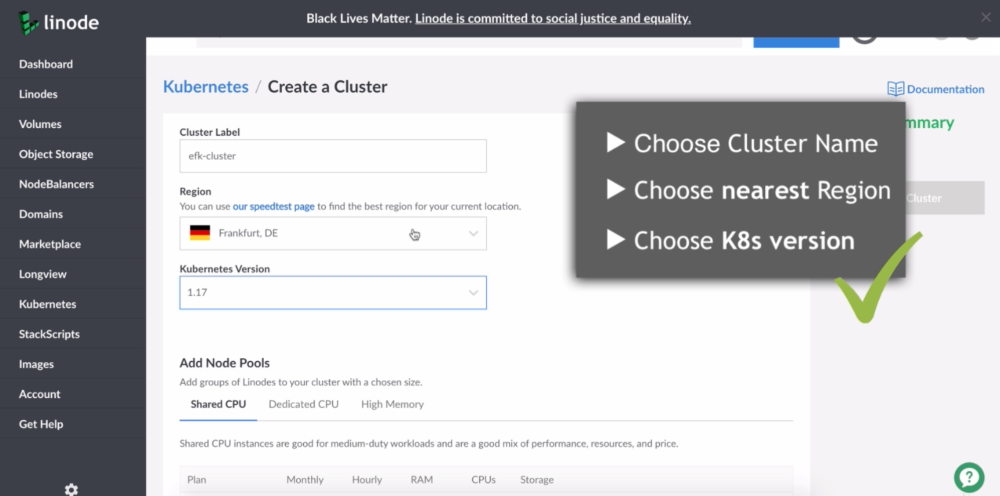

##### create [linode](https://cloud.linode.com/) account 

##### create k8s cluster

##### upload _kubeconfig.yaml_ file, connect to cluster
    export KUBECONFIG=~/Downloads/efk-cluster-kubeconfig.yaml

##### deploy and access dasboard
    kubectl apply -f https://raw.githubusercontent.com/kubernetes/dashboard/v2.0.0/aio/deploy/recommended.yaml

##### wait for a couple of seconds for all components to get created and started before executing below commands
    kubectl proxy 
    http://localhost:8001/api/v1/namespaces/kubernetes-dashboard/services/https:kubernetes-dashboard:/proxy/.

